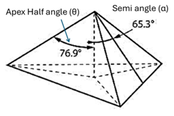
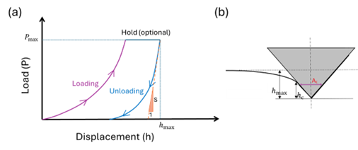

## Essential Components of a Nanoindentation System
A nanoindentation instrument is fundamentally designed to apply a precisely controlled force and simultaneously measure the resulting penetration depth with very high accuracy. Reliable property measurements depend primarily on a few core components that directly control contact mechanics and data acquisition.
The indenter tip is the contacting element that penetrates the material surface. It is typically fabricated from diamond to ensure that the tip remains rigid and does not deform during testing. Common geometries such as Berkovich or spherical tips are selected based on the type of mechanical response being studied. The known geometry of the tip is critical because the projected contact area is calculated from it, which directly determines hardness and modulus values. We will be using diamond Berkovich tip for our experiments (Figure 1).
The loading (force actuation) system applies the test load in a controlled and repeatable manner. It enables gradual loading, holding, and unloading cycles over micro-Newton to milli-Newton ranges. Accurate force control ensures stable indentation and prevents dynamic effects that could alter the measured response.
The displacement measurement system records the penetration depth of the indenter into the sample with nanometer-scale resolution. Since nanoindentation properties are extracted from the load–displacement curve, precise depth sensing is essential for correctly separating elastic recovery from permanent deformation.
The sample stage securely holds the specimen and provides fine positioning so that indentations can be placed at specific locations on the surface. Proper alignment between the indenter and the sample ensures consistent and reproducible contact conditions.
Finally, the data acquisition and analysis software continuously captures load and depth signals and processes them using established contact mechanics models to compute hardness, elastic modulus, and related parameters.

Figure 1: Schematic of a Berkovich diamond indenter showing its three-sided pyramidal geometry with a total included angle of 142.3°, designed to provide the same projected area–depth relationship as a Vickers indenter. The sharp geometry enables well-defined contact mechanics and accurate determination of projected contact area, making it widely used for nanoindentation-based measurements of hardness and elastic modulus.

## Principle of Nanoindentation
Nanoindentation is a depth-sensing mechanical testing technique in which a sharp diamond indenter (we are using Berkovich indenter) is pressed into the surface of a material while both the applied load and the penetration depth are continuously monitored. The test produces a load–displacement curve, commonly called the P–h curve (Figure 2 (a)), which captures the elastic and plastic response of the material at the nanoscale.
Unlike conventional hardness tests, where only the residual impression is measured after unloading, nanoindentation determines properties directly from the entire loading–unloading response. As a result, both hardness and elastic modulus can be obtained from a single indentation cycle without imaging the indent.

#### Load–Displacement Response and Its Interpretation
A typical nanoindentation experiment consists of three stages (Figure 2a and 2b):
##### Loading stage:
The indenter penetrates the surface as the load increases. Both elastic and plastic deformation occur.
##### Hold segment (optional):
The load is maintained at its maximum value to study time-dependent deformation such as creep or viscoelastic effects.
##### Unloading stage:
The load is gradually removed. The initial part of this segment is assumed to be primarily elastic and is used to determine the elastic stiffness of the material.
The deepest penetration reached during loading is denoted as the maximum depth, h_max.

Figure 2: (a) The load vs displacement (p-h) curve indicating loading, hold and unloading stages during a typical nanoindentation experiment. (b) A schematic demonstrating hmax, hc, Ac

## Contact Mechanics and Depth Parameters
To extract meaningful properties, it is necessary to distinguish between different measures of indentation depth.

- hmax: maximum penetration depth at peak load  
- hc: contact depth, representing the actual depth of contact between the indenter and the material  

The contact depth is calculated as:

hc = hmax − ε (Pmax / S)

Where, Where,

- Pmax = maximum applied load  
- S = (dP/dh)unload = unloading stiffness (slope of the initial unloading curve)  
- ε = geometric constant depending on indenter shape (≈ 0.75 for Berkovich)

<b>Assumption:</b>  
The initial unloading response is purely elastic and follows linear elastic contact mechanics.

### Projected Contact Area
The projected contact area Ac is the area of material actually in contact with the indenter at peak load.

For an ideal Berkovich indenter:

Ac = 24.5 hc2

In practice, tip rounding and imperfections cause deviations from the ideal geometry. Therefore, an experimentally calibrated area function is often used:

Ac = C0 hc2 + C1 hc + C2 hc1/2 + …

where C0, C1, C2 are calibration constants obtained using a reference material.

It is important to note that the surface must be smooth and homogeneous over the indentation region for getting better results

### Hardness Measurement
Hardness is defined as the mean contact pressure under the indenter at maximum load:

H = Pmax / Ac

Where:

- H = nanoindentation hardness  
- Pmax = maximum applied load  
- Ac = projected contact area  

Physically, hardness represents the material’s resistance to permanent (plastic) deformation during localized contact.

<h3>Elastic Modulus Determination</h3>

<b>Reduced Modulus</b>

The slope of the initial unloading curve gives the contact stiffness S. From this, the reduced modulus Er is obtained as:

Er = (1 / 2β) √(π / Ac) S

Where, β = geometry correction factor (≈ 1.034 for Berkovich).  
The reduced modulus accounts for elastic deformation in both the indenter and the specimen.

<h3>Specimen Modulus</h3>

The true elastic modulus of the specimen Es is calculated using:

1 / Er = (1 − νs2) / Es + (1 − νi2) / Ei

Where:

- Es, νs = modulus and Poisson’s ratio of the specimen  
- Ei, νi = modulus and Poisson’s ratio of the indenter  
  (for diamond: Ei ≈ 1140 GPa, νi ≈ 0.07)

<b>Assumptions:</b>  
The material behaves as a linear elastic, isotropic solid during unloading and the Poisson’s ratio is known.

<h3>Correlation Between Mechanical Properties and Wear Resistance</h3>

Wear during sliding or abrasive contact can be viewed as a sequence of repeated microscopic indentations caused by surface asperities. At each contact, the material either deforms elastically and recovers or undergoes permanent plastic deformation that leads to grooves, cracks, and debris formation. Consequently, wear resistance depends on the balance between elastic recovery and plastic damage.

Nanoindentation provides two useful parameters that capture this balance:

<h4>Elastic strain to failure indicator: H/E</h4>

This ratio represents the elastic strain a material can sustain before yielding. Higher values indicate greater elastic recovery, smaller residual impressions, and improved resistance to crack initiation and fatigue wear.

<h4>Plastic deformation resistance index: H3/E2</h4>

This parameter reflects resistance to irreversible plastic flow and is related to the size of the plastic zone beneath the contact. Larger values correspond to reduced ploughing, less pile-up, and lower material removal.

Materials that exhibit high values of both H/E (dimensionless) and H3/E2 (GPa) generally demonstrate superior wear performance. These ratios are particularly useful for coatings and thin films, where rapid screening of tribological behavior is required without conducting extensive wear tests.

<h3>Limitations</h3>

Although these parameters provide valuable insight into wear behavior, they are indirect indicators. Actual wear performance also depends on factors such as environment, surface roughness, microstructure, and contact conditions. Therefore, nanoindentation results should be interpreted alongside dedicated tribological testing.

